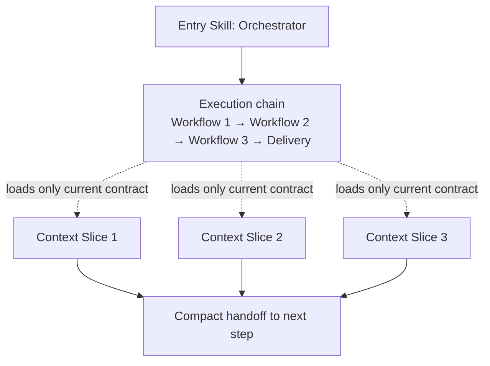

# Agentic Workflows Blueprint

A meta-skill that teaches your AI agent how to build operational skills
for each module and system in your project — so it loads only the context
it needs, when it needs it.

Instead of one massive `AGENTS.md`, your agent gets a routing system:
it classifies the task, loads the right skill, executes deterministically,
and hands off to the next step. Less tokens, more precision.

---

## Quick run

```bash
npx skills add devton/agentic-workflow-blueprint
```

Then call the agent in your target repository with a direct prompt like:

```text
blueprint this project.
```

After that, wait for the agent to finish the scaffold. The expected first
deliverable is the main project skill file at `skills/<projectSlug>/SKILL.md`.

---

## The problem it solves

You have a project with multiple modules. Your AI agent loads everything
every time — all rules, all context, all history. That burns tokens and
dilutes focus.

This blueprint lets the agent build **scoped skills per module**, each
with its own contract, inputs, outputs, and review gates. The agent
only loads what's relevant to the current task.

---

## How it works in practice

**Without this blueprint:**
You tell your agent "add a payment module". It loads your entire
AGENTS.md (500+ lines), guesses conventions, and wings it.

**With this blueprint:**

1. You trigger this skill once: _"set up my project"_ — it asks a few
   questions and scaffolds `skills/<project>/` with routing, contracts,
   and workflows.
2. Next time you say _"add a payment module"_, the agent classifies the
   task → loads only `skills/<project>/workflows/modules/SKILL.md`
   → follows the deterministic procedure → passes the review gate
   → hands off.
3. You adjust any workflow in plain conversation — it's just markdown
   the agent reads and follows.

---

## Why this saves tokens

- **Scoped loading** — agent loads only the skill for the current step,
  not the whole project context.
- **Bounded contracts** — clear inputs, outputs, and pass/fail gates
  keep the agent deterministic.
- **Focused retries** — when something fails, the agent retries only
  the failed gate, not the entire conversation.
- **Structured handoffs** — steps communicate via defined inputs/outputs,
  not free-form context dumps.

---

## Why turn plans into skills

Plans are useful in chat, but they are ephemeral. Turning a technical plan into
skills makes execution repeatable:

- **Persistence** — workflows survive beyond a single session.
- **Determinism** — contracts replace vague "implement this" instructions.
- **Verification** — review gates turn plan acceptance criteria into pass/fail checks.
- **Routing** — the entry skill loads only the workflow needed for the current step.

Use the `plan-to-blueprint` workflow when you already have a plan and want the
agent to scaffold `skills/<projectSlug>/` with router commands and manifests.

---

## Blueprint vision



---

## Getting started

When you trigger this blueprint, the agent will ask:

- **projectSlug** — short name for the repo (e.g. `my-backend`)
- **baseBranch** — main integration branch (e.g. `main`, `develop`)
- **techStack** — what's the stack? (e.g. `NestJS + PostgreSQL + Redis`)
- **workflowsWanted** — which workflows to scaffold
  (e.g. `modules`, `specs`, `document`, `review`)
- **constraints** — hard rules
  (e.g. "no ORM, raw SQL only", "all API calls go through service layer")

Then it generates the full structure and wires everything into your
`AGENTS.md` or `CLAUDE.md` — no manual wiring needed.

### What gets generated

```
skills/<projectSlug>/
  SKILL.md                          ← Orchestrator (entry point)
  template.json                     ← Declarative command manifest
  reference/
    routing-matrix.md               ← Task → workflow mapping
    role-contracts.md               ← Roles, boundaries, handoffs
    hook-blueprint.md               ← Optional automation hooks
  workflows/
    <workflowName>/SKILL.md         ← One per workflow
    <workflowName>/template.json    ← Optional per-workflow manifest

docs/runbooks/
  agent-role-system.md              ← Operator-facing playbooks
  agent-role-hooks.md               ← Optional hook runbook
  plan-to-blueprint.md              ← Plan → skill scaffold playbook
```

### Skill manifest (`template.json`)

`SKILL.md` is the source of truth. `template.json` is a complementary manifest
for agents and tools that expose a command interface:

```json
{
  "name": "my-backend",
  "version": "1.0.0",
  "entry": "SKILL.md",
  "routing": "router-only",
  "commands": [
    {
      "name": "document",
      "description": "Build docs from implementation evidence",
      "skill": "workflows/document/SKILL.md"
    },
    {
      "name": "plan-to-blueprint",
      "description": "Turn a technical plan into executable project skills",
      "skill": "workflows/plan-to-blueprint/SKILL.md"
    }
  ]
}
```

Keep `commands[].name` aligned with workflow folder names and with the Command
routing section in the entry `SKILL.md`.

---

## Command routing

After scaffold, invoke internal workflows through the project entry skill
(router-only):

```text
/<skillName> document
/<skillName> review
/<skillName> plan-to-blueprint
```

Chained intent in one message (agent resolves sequentially):

```text
/<skillName> document review changelog
```

**Fallback** when the agent does not parse subcommands: invoke `/<skillName>`
and pass the subcommand in the prompt, e.g. _"Run subcommand `document` using
the command routing in skills/my-backend/SKILL.md."_

---

## Included workflow examples

These are **templates** — copy, rename, and adapt to your project's
actual workflows (deploy, test, migrate, etc).

| Workflow             | What it does                                              | When to use                                             |
| -------------------- | --------------------------------------------------------- | ------------------------------------------------------- |
| `document`           | Builds docs from git diff evidence                        | After implementation is done                            |
| `review`             | Validates docs with deterministic pass/fail               | Auto-step after `document`                              |
| `changelog`          | Generates changelog from approved docs                    | After `review` passes                                   |
| `linear`             | Creates Linear projects/issues via MCP                    | Multi-PR initiatives                                    |
| `mcp-linear-planner` | Preflight check + execution plan for Linear               | When you need stricter control                          |
| `mcp-linear-sync`    | Executes planned Linear operations                        | After `planner` validates                               |
| `plan-to-blueprint`  | Converts a technical plan into project skills + manifests | After Plan mode or before multi-workflow implementation |

### Plan → blueprint example

```text
/<my-backend> plan-to-blueprint

Technical plan: [paste milestones, tasks, acceptance criteria, constraints]
Project: my-backend, baseBranch: main, techStack: NestJS + PostgreSQL
```

Expected output: `skills/my-backend/SKILL.md`, `template.json`, workflow
contracts under `workflows/`, and updated root doc links.

### Chained flow example (document → review → changelog)

```
attempt = 1
while attempt <= 3:
  doc = run(document)
  review = run(review, input=doc)
  if review.pass:
    run(changelog, input=doc)
    break
  attempt += 1
```

1. `document` produces docs from implementation evidence.
2. `review` validates against the evidence.
3. If fail → feed findings back to `document`, retry (max 3).
4. If pass → `changelog` generates the entry.

---

## The contract format

Every workflow is an executable contract the agent follows:

```
Goal        → 1 sentence: what this workflow does
Scope       → applies to / does not cover
Triggers    → file patterns + intent phrases
Inputs      → what the workflow needs
Invariants  → hard rules that cannot be violated
Procedure   → deterministic steps (evidence-driven)
Outputs     → what must be produced
Review gate → pass/fail checklist
References  → links to parent skill and related workflows
```

This format keeps each workflow self-contained, linkable, and bounded.
Agents don't need to reason over the entire project — they follow the
contract for the current step.

---

## Included runbooks

Runbooks are operator-facing execution playbooks (for humans managing
agent runs). Workflow SKILL files are agent-facing contract definitions.

- **`document-review-changelog.md`** — operational guide for the 3-step
  doc loop with retry logic.
- **`linear-mcp.md`** — operational guide for direct Linear workflow.
- **`mcp-linear-sync.md`** — operational guide for the planner → sync
  decomposition.
- **`plan-to-blueprint.md`** — operational guide for plan → skill scaffold.

---

## How to use this repo

1. Read `SKILL.md` for the full blueprint procedure.
2. Trigger the skill in your agent with your project details.
3. The agent scaffolds the structure and wires it into your root doc.
4. Adjust workflows as needed — it's markdown, edit in conversation.
5. Add new workflows over time by following the contract format.

Stack-agnostic by design. Stack-specific rules (ORM patterns, testing
conventions, deployment quirks) go in the project skill and get linked
from individual workflows.
