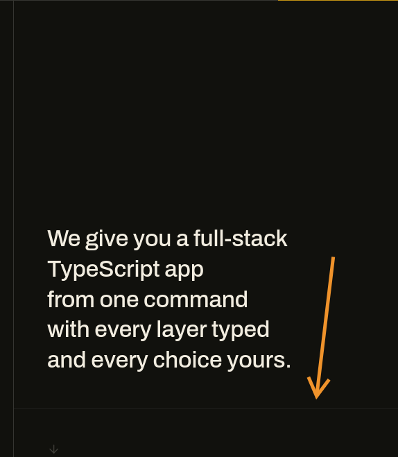

# Spec: Home Editorial System

## Status

Design direction ready for implementation

## Date

July 19, 2026

## Goal

Evolve the Better T Stack home into a dense, editorial product surface inspired by the _interaction grammar_ observed on `mistral.ai`: structural grids, oversized declarative type, a fixed utility header, contained motion, and composed content modules.

This is an original Better T Stack system. It must retain the project palette, copy, logo, routes, data, and existing dark “System Manual” identity. Do not reproduce Mistral’s wordmark, pixel assets, orange/red/blue palette, copy, illustrations, exact layout dimensions, or brand-specific navigation taxonomy.

## Research evidence

Playwright inspection of `https://mistral.ai/` on July 19, 2026, at 1440 × 1000 and 390 × 844, found these reusable patterns:

- [Desktop homepage capture (1440 × 1000)](../.playwright-cli/page-2026-07-19T14-39-54-800Z.png)
- [Mobile homepage capture (390 × 844)](../.playwright-cli/page-2026-07-19T14-41-46-832Z.png)
- [Mobile navigation open capture](../.playwright-cli/page-2026-07-19T14-42-38-388Z.png)

These local captures are layout-reference evidence only. They are not product assets and must not be shipped or used as source material for visual copying.

- A 49 px fixed desktop header uses one-pixel dividers, rectangular navigation cells, and a high-contrast terminal action. It does not rely on rounded floating controls.
- The desktop hero is a two-column editorial composition: oversized headline on the dominant left area; short positioning statement and small utility/featured-news area on the right.
- A decorative animated canvas sits below the hero copy. It uses colored geometric blocks while the content and reading order remain DOM text and links.
- The page is built as a sequence of full-width modules: logo ticker, story carousel, product mosaic, narrative detail panels, proof cards, and final conversion. Repetition comes from rules, spacing, and type—not card shadows.
- The inspected page contains one canvas, no video in the home composition, and custom elements for its hero, carousels, scrolling logos, sliders, and navigation. The canvas is decorative: it had no accessible role or label.
- Motion is deliberately narrow. Header and surface colors transition at 150 ms; link affordances use 150–300 ms transform/opacity movement; the hero canvas supplies the continuous visual movement. Grid dimensions do not animate on hover.
- On mobile, the hero becomes a single reading column. The headline, positioning statement, and featured news card appear before the canvas. The navigation changes from desktop cells to an explicit, full-screen menu with 44 px+ row targets and fixed actions at its bottom.

The external site’s current body surface is `rgb(251, 251, 248)`, header height is 49 px, its body type is Inter, its small labels are Space Mono at 13 px, and its supporting desktop type is 32 px / 40 px. These are observations, not values to copy.

## Existing Better T Stack foundation

Use the current home structure and tokens as the foundation:

- Page composition: `apps/web/src/app/(home)/page.tsx`.
- Fixed header and responsive navigation: `apps/web/src/components/site/site-header.tsx`.
- Home primitives: `.ui-frame`, `.ui-rule-grid`, `.ui-kicker`, `.ui-display`, and `.ui-scroll-target` in `apps/web/src/app/global.css`.
- Current modules: hero, sponsors, command, product mosaic, capabilities, stats, testimonials, and footer.
- **Page frame + continuous rails:** see [`spec-page-frame-and-aligned-rails.md`](./spec-page-frame-and-aligned-rails.md) (Playwright-measured Mistral gutters + Efferd aligned borders). Implement that spec before further density work on the shell.

The product mosaic already provides the right structural starting point. Extend the language across the page; do not replace its navigable, full-surface link behavior with decorative cards.

## Visual principles

1. **The frame is the interface.** A restrained **soft** 1 px rule grid creates hierarchy and alignment. Surfaces touch; gaps are reserved for actual content rhythm, not for card decoration. Rules must stay **low-contrast and quiet** (see [Structural border standard](#structural-border-standard-application-wide)).
2. **Type establishes the route.** Use one concise, declarative headline per module. Supporting prose is narrow and calm. Monospace labels provide navigation, indexes, and metadata.
3. **One visual signal at a time.** Gold is reserved for the primary action, a selected state, or a small active marker. It must not fill every module.
4. **Motion explains state, never structure.** Animate only color, opacity, and a small directional icon offset. Functional destinations must be complete before motion starts and without JavaScript. Authored marketing/page motion uses **GSAP** as the project standard; see [`spec-gsap-motion-system-and-hero-title.md`](./spec-gsap-motion-system-and-hero-title.md).
5. **A dark interface needs depth without shadows.** Use background, card, secondary, and muted tokens plus the **soft rule** token; do not introduce blur-heavy glass, gradients, or elevation stacks.

## Structural border standard (application-wide)

**Decision (July 20, 2026):** the quiet hairline visible on the featured-rail mission divider becomes the **default structural border tone for the entire marketing web app** — not only the home hero.

### Visual source of truth



| Capture              | Path                                                                                   |
| -------------------- | -------------------------------------------------------------------------------------- |
| Soft rule (Image #2) | [`captures/editorial-soft-rule-border.png`](./captures/editorial-soft-rule-border.png) |

**Observed intent:** a 1 px horizontal separator that sits almost into the dark canvas — present enough to define bands, never loud enough to compete with type or gold actions.

### Token contract (canonical)

Implement by **redefining** the shared tokens so every existing `border-rule` / `bg-rule` / grid seam inherits the softer tone. Prefer one solid token over scattering `border-rule/40` in components.

| Token             | Role                                         | Target value (dark shell)                             | Notes                                                                                                                                                                              |
| ----------------- | -------------------------------------------- | ----------------------------------------------------- | ---------------------------------------------------------------------------------------------------------------------------------------------------------------------------------- |
| `--rule`          | **Default structural border / page grid**    | `color-mix(in srgb, white **6%**, var(--background))` | Matches the visual weight of former `border-rule/40` when `--rule` was `white 15%` (~0.15 × 0.40 ≈ 0.06). This is the **global default**.                                          |
| `--border`        | Component chrome that uses the same language | **Same as `--rule`** (or one shared alias)            | Stop shipping a louder brown `#373220` / `#3d3824` for routine module edges. Align `--border` → `--rule` so shadcn/`border-border` and editorial `border-rule` read as one system. |
| `--rule-frame`    | Optional outer frame laterals (tablet only)  | May stay stronger (`white ~28%`)                      | **Exception:** page-frame side rails per [`spec-page-frame-and-aligned-rails.md`](./spec-page-frame-and-aligned-rails.md) / batch-2 tablet frame — not the default interior seam.  |
| Focus / gold ring | `--ring`                                     | unchanged `#e0b43e`                                   | Never replace focus with the soft rule alone.                                                                                                                                      |

**Utility mapping**

| Utility / pattern                                                                                      | Must use                                                      |
| ------------------------------------------------------------------------------------------------------ | ------------------------------------------------------------- |
| Module seams, column rails, card outlines, header cell dividers, mosaic gaps (`bg-rule`), footer rules | `border-rule` or `border-border` after tokens converge        |
| Featured rail divider, featured card outline                                                           | plain `border-rule` (drop ad-hoc `/40` once `--rule` is soft) |
| Hover emphasis on a seam                                                                               | optional `border-primary` / gold — not a brighter gray rule   |

### Application scope (all of these must match the capture tone)

1. **Hero** — left/right column rails, mission ↔ featured horizontal split, featured card outline.
2. **Site header** — cell dividers (`border-r` / `border-l` / `border-b` on the bar).
3. **Home modules** — sponsors/ecosystem, command, mosaic seams, capabilities, community cards, footer grids.
4. **Shared UI** — any marketing-shell surface that currently uses `border-rule`, `border-border`, or hard-coded brown borders for structure.
5. **Docs chrome** — prefer the same soft rule when it shares global tokens (do not invent a second “loud” docs grid).

### Implementation rules

1. **Single source of truth:** change `--rule` (and align `--border`) in `apps/web/src/app/global.css`. Do not leave half the app on `white 15%` and half on `/40`.
2. **No parallel louder system:** remove or stop introducing solid `#373220`-style structural borders for routine layout.
3. **One pixel only:** structural rules remain `1px solid`; do not thicken to create hierarchy.
4. **Not for text or sole state:** soft rules stay non-text decoration. Required meaning still uses type, gold, or focus ring.
5. **After token change:** replace temporary `border-rule/40` (e.g. featured rail) with `border-rule` so opacity hacks do not stack on an already-soft token.
6. **Regression:** at 1440 and 390, seams must remain visible on `#11110d` (or current `--background`) without reading as chalk lines.

### Acceptance (border standard)

- [ ] Capture tone (Image above) is the default for **all** structural `border-rule` / aligned `border-border` seams on the marketing shell.
- [ ] No module reintroduces a high-contrast brown/gray rail for ordinary division.
- [ ] Focus rings and primary gold actions remain higher contrast than the soft rule.
- [ ] `bun run check` passes after the token roll-out.

## Better T Stack token contract

Keep the existing semantic variables. Update structural border values to the soft-rule standard above. Surface values track the current slightly lifted dark canvas (not the original near-black `#080806` if the shell has been lightened).

| Token                  | Canonical value (dark shell)                          | Home / app role                                      |
| ---------------------- | ----------------------------------------------------- | ---------------------------------------------------- |
| `--background`         | `#11110d` (or current canvas)                         | Main canvas and negative space                       |
| `--foreground`         | `#f2ede0`                                             | Display and body copy                                |
| `--primary`            | `#c49314`                                             | Primary conversion, active marker, key emphasis      |
| `--primary-foreground` | match canvas                                          | Text/icons on gold action surfaces                   |
| `--accent`             | `#d6a72b`                                             | Hover/selected gold variation only                   |
| `--muted-foreground`   | `#b0a78d` / `#aaa187`                                 | Labels and supportive metadata                       |
| `--card`               | one step above background                             | Quiet featured or media-adjacent surfaces            |
| `--secondary`          | recessed step                                         | Recessed/hover surfaces                              |
| `--border`             | **same soft mix as `--rule`**                         | Component division — **aligned to soft rule**        |
| `--rule`               | **`color-mix(in srgb, white 6%, var(--background))`** | **Default page-grid / structural border (app-wide)** |
| `--rule-frame`         | `color-mix(in srgb, white 28%, var(--background))`    | Tablet/mobile outer frame only (exception)           |

`--border` and `--rule` remain structural, non-text colors. Do not use either for text, essential iconography, focus states, or as the only state indicator. Text remains `--foreground`, `--muted-foreground`, `--primary`, or a verified equivalent. Retain `--ring: #e0b43e` for keyboard focus.

## Page architecture

```text
main.ui-frame
├── Hero: statement + contextual proof + decorative signal field
├── Sponsor/credibility ticker: restrained moving proof
├── Command: product understanding and primary conversion
├── Explore mosaic: deliberate route map
├── Capabilities: editorial detail, one system concept per panel
├── Proof: stats then testimonials
└── Footer: dense, rule-based route map and final conversion
```

Preserve this content order. At mobile widths, it is also the reading and tab order. Do not re-order via CSS to make a desktop composition appear more dramatic.

## Hero specification

### Desktop (1024 px and above)

- Keep the fixed 56 px Better T Stack header. Treat it as a row of outlined cells: mark, section links, GitHub utility, and gold `Build a stack` action.
- Place the hero under the header in a 12-column grid, with a minimum first-viewport height of `calc(100svh - 3.5rem)` only when content remains above the fold.
- The lead statement spans 7–8 columns. Use `ui-display`, `clamp(3.5rem, 8vw, 8.5rem)`, `line-height: 0.9–0.96`, tight tracking, and no more than two or three lines. For the SEO dual-title pattern (visually hidden `h1` + decorative animated display line) and the GSAP motion standard, see [`spec-gsap-motion-system-and-hero-title.md`](./spec-gsap-motion-system-and-hero-title.md).
- A 4–5-column companion panel contains an eyebrow/index, a 2–4 line positioning statement, a compact proof item or rotating release note, and the primary action only if it does not duplicate the header action.
- Place a decorative `SignalField` below or adjacent to the content in an explicitly non-interactive grid region. It must not cover text or links and must be absent from the accessibility tree.
- Use the **soft** `border-rule` (application-wide structural standard) on the outer edge and internal divisions. Avoid rounded hero containers, drop shadows, gradients, and editorial photography.

### Mobile (below 768 px)

- Use one column in this order: label, headline, positioning statement, proof/release item, then decorative signal field.
- Headline: `clamp(2.75rem, 12vw, 4.25rem)`, line height about `0.96`. Never truncate it or depend on hard line breaks that fail at 320 px.
- The contextual proof item is a full-width link or static block, minimum 44 px high. It must have a visible label and a directional affordance.
- `SignalField` becomes a short fixed-aspect field (`16 / 9` or `4 / 3`), not a second viewport of decoration.

## SignalField: original decorative animation

Build an original Better T Stack signal field rather than a colored-block copy.

- **Visual language:** dark grid cells, occasional gold signal squares/lines, and muted cream/pale-gold glyphs inspired by typed stack configuration—not pixel characters or Mistral-like geometric sequences.
- **Implementation:** a CSS grid or a canvas loaded only after the hero is visible. Prefer a CSS grid for a small number of cells. Use a canvas only if the animation needs a dense field and can stay isolated in a client component.
- **Accessibility:** `aria-hidden="true"`, `pointer-events-none`, no semantic information, and no text that is required to understand the page.
- **Motion:** 6–12 cells may fade or swap state over 2.4–4.8 seconds with randomized stagger. No rapid flashing, no full-field displacement, no parallax tied to pointer movement.
- **Reduced motion:** with `prefers-reduced-motion: reduce`, render one static arrangement; do not mount an animation loop.
- **Performance:** cap device pixel ratio at 2 for canvas rendering, pause/intersect-observe when outside the viewport, and avoid React state updates per frame.

## Module system

### Structural header and navigation

- Keep `SiteHeader` as the single header implementation. Do not create a second home-only navigation.
- Desktop nav cells have a 1 px divider and a 150 ms surface/text transition. Hover changes only `background-color` and text color.
- Preserve the existing accessible dropdown and dialog behavior. Desktop may use a compact multi-column `Explore` menu; mobile must use an explicit trigger, an accessible dialog, and a visible close action.
- Every navigation item has a visible text label. Icons remain supplementary and `aria-hidden`.

### Sponsor/proof ticker

- The current sponsor section can borrow the reference’s moving-logo principle, but logos remain monochrome/low-emphasis on the Better T Stack dark base.
- Motion is optional: duplicate enough content for a seamless visual loop only if all duplicate logos are `aria-hidden`; provide a static row under reduced motion.
- Treat this as proof, not a loud marquee. It must not outrank the hero headline or primary action.

### Command and capability sections

- Compose each concept as a ruled editorial panel: index/eyebrow at the top, declarative headline, one concise explanation, then an action or code/proof region.
- Use alternating `background`, `card`, and `secondary` surfaces to establish rhythm. Never pair multiple gold panels consecutively.
- Keep the existing command as selectable text and a real copy interaction. Do not hide core product information inside an animated terminal mockup.
- Capability panels should reveal detail through normal page flow or an accessible disclosure; avoid hover-only overlays.

### Product mosaic

- Retain the existing 12-column asymmetry, full-tile `Link` semantics, tab order, and structural empty cells from `product-mosaic-section.tsx`.
- Reframe it as the home’s “route map”: strong index labels, one primary gold tile, card/secondary surfaces for the rest, and stable **soft** 1 px seams (`--rule` / soft-rule standard).
- Hover changes tone/rule and moves the arrow by at most 4 px over 150–200 ms. No tile grows, no grid reflows, and no text slides out of reach.

### Stats, testimonials, and footer

- Stats use a small mono label plus a large number/value. Align numerals along the grid and use a single gold highlight per group at most.
- Testimonials need clear author/source provenance and readable static content. Any carousel needs previous/next buttons, keyboard support, a paused reduced-motion state, and no autoplay-dependent content.
- The footer is a dense route map of text groups divided by rules. End with one clear conversion rather than competing primary buttons.

## Interaction and motion contract

| Interaction       | Default                                      | Fine-pointer hover                                   | Focus-visible                               | Reduced motion                         |
| ----------------- | -------------------------------------------- | ---------------------------------------------------- | ------------------------------------------- | -------------------------------------- |
| Nav/link cell     | Stable dark surface, text and arrow          | `background-color`/text 150 ms; arrow up-right ≤4 px | 2 px `--ring` outline, whole target visible | Instant color state; no arrow movement |
| Primary action    | `--primary` with `--primary-foreground`      | `--accent`, no scaling                               | Same visible ring plus high contrast        | Instant color state                    |
| Mosaic tile       | Stable grid and 1 px rule                    | Tone/rule 150–200 ms; icon ≤4 px                     | Ring on full tile boundary                  | No transform                           |
| Disclosure/dialog | Closed until explicit control                | No hover dependency                                  | Trigger and close are keyboard reachable    | Opacity only or instant                |
| SignalField       | Decorative slow change                       | No pointer reaction                                  | Not focusable                               | Static frame                           |
| Carousel/ticker   | Controls exposed and static content readable | Optional drag only as enhancement                    | Arrow/button controls operable              | Paused/no auto-advance                 |

Use `motion-safe:` utilities for optional transforms. The standard interactive timing is `150ms ease-out`; directional icon transitions may be `200ms`. Do not introduce spring physics, layout transitions, continuous type movement, cursor trails, or scroll-jacking.

## Accessibility requirements

- The primary content and every destination remain usable with JavaScript disabled, a keyboard, touch, and screen readers.
- Keep heading order logical: one `h1` in the hero, then `h2` per major section. Tile titles do not need heading roles unless they represent actual document sections.
- Full-surface links have visible text; arrow icons are `aria-hidden`.
- Keyboard focus uses the existing gold `--ring`, at least 2 px, and is never removed for aesthetic reasons.
- Pointer-only hover effects are decorative. Mobile controls are at least 44 × 44 px; menu rows and primary actions exceed that minimum.
- All informational text maintains WCAG 2.2 AA contrast. Rules and muted decoration never carry required meaning alone.
- Respect `prefers-reduced-motion` across SignalField, ticker, carousel, icon translations, and any number/count animation.

## Implementation boundaries

### In scope

- Refine the current home components and shared home primitives to follow this editorial system.
- **Roll the soft structural border (`--rule` / aligned `--border`) across the marketing shell** so every `border-rule` / routine `border-border` matches [`captures/editorial-soft-rule-border.png`](./captures/editorial-soft-rule-border.png).
- Add a small original `SignalField` component if it remains decorative, responsive, reduced-motion-safe, and performance-contained.
- Improve responsive composition and interaction feedback using current Tailwind tokens and components.
- Update visual regression/Playwright checks for desktop and mobile states.

### Out of scope

- Copying Mistral visual assets, content, exact geometry, navigation labels, color palette, or source code.
- Changing Better T Stack routes, sponsor/testimonial data contracts, or the global brand palette.
- Introducing a new animation library, design system dependency, carousel package, or custom font solely to resemble the reference.
- Replacing accessible links with canvas hotspots or interaction that relies on hover.

## Acceptance criteria

- The home reads as one coherent dark editorial system rather than a collection of rounded cards.
- Desktop shows a structured hero, an intentionally asymmetrical route map, and calm module sequencing within the current `ui-frame`.
- Mobile is a clean single-column narrative with an explicit navigation dialog and no decorative blank space.
- Gold communicates the primary action/active signal only; the rest of the palette remains the existing black, cream, and muted-gold system.
- **Structural borders match the soft-rule standard** ([capture](./captures/editorial-soft-rule-border.png)): one quiet 1 px tone app-wide via `--rule` / aligned `--border`; no loud brown rails for routine seams.
- All text and interactive states satisfy the contrast contract above; focus is visible on every action.
- Continuous animation is confined to original decorative signal/proof areas, pauses or becomes static for reduced motion, and never affects layout or comprehension.
- The page contains no Mistral copy, assets, palette values, or brand-specific elements.
- `bun run check` passes after implementation.

## Verification plan

1. Run `bun run check`.
2. Inspect `/` with Playwright at 1440 × 1000, 768 × 1024, 390 × 844, and 320 × 720.
3. Capture default, nav-open, focused primary action, focused first/last mosaic tile, and reduced-motion screenshots.
4. At desktop width, hover a navigation cell and a mosaic tile; confirm only tone/rule/icon changes and no layout shift occurs.
5. At mobile width, tab through the header menu, open/close it with keyboard, then activate the first and last home route.
6. Verify SignalField is absent from the accessibility tree, never captures pointer events, and is static with reduced motion.
7. Check text-to-background contrast for any newly introduced semantic color before merging.
