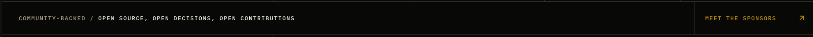
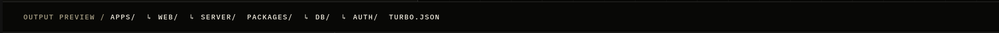
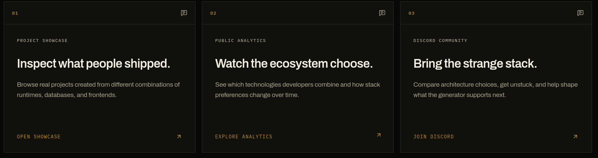

# Spec: Kubo Home UI Polish — Batch 3

## Status

Ready for implementation

## Date

July 20, 2026

## Goal

Three home polish items from rendered captures:

1. **Remove** the sponsors footer bar (`Community-backed / …` + `Meet the sponsors`).
2. **Remove** the command-section output preview bar (`Output preview / apps/ web/ … turbo.json`).
3. **Community cards** — increase card height; **delete** the per-card header row (`01` / icon).

This continues `spec-kubo-home-ui-polish-batch-2.md`. It does not change routes, package names, or mosaic IA.

## Visual evidence (source captures)

Paths are relative to `docs/` (this file’s directory).

| Capture  | Relative path                                                                        | Surface / intent                                                                                                                   |
| -------- | ------------------------------------------------------------------------------------ | ---------------------------------------------------------------------------------------------------------------------------------- |
| Image #1 | [`captures/batch3-sponsors-bar.png`](./captures/batch3-sponsors-bar.png)             | Thin full-width bar: muted kicker `COMMUNITY-BACKED / OPEN SOURCE…` left, gold `MEET THE SPONSORS ↗` right — **delete entire bar** |
| Image #2 | [`captures/batch3-output-preview-bar.png`](./captures/batch3-output-preview-bar.png) | Thin full-width bar: `OUTPUT PREVIEW / APPS/ ↳ WEB/ … TURBO.JSON` — **delete entire bar**                                          |
| Image #3 | [`captures/batch3-community-cards.png`](./captures/batch3-community-cards.png)       | Three community cards with top chrome (`01` + message icon) + body + CTA — **remove top chrome**, **increase body height**         |

### Image #1 — sponsors foot bar



```text
┌──────────────────────────────────────────────────┬─────────────────────┐
│ COMMUNITY-BACKED / OPEN SOURCE, OPEN DECISIONS…  │ MEET THE SPONSORS ↗ │
└──────────────────────────────────────────────────┴─────────────────────┘
  min-h ≈ 56–64px · border-t · ui-kicker · Link to /sponsors
```

### Image #2 — command output preview bar



```text
┌────────────────────────────────────────────────────────────────────────┐
│ OUTPUT PREVIEW / APPS/  ↳ WEB/  ↳ SERVER/  PACKAGES/  ↳ DB/ … TURBO.JSON│
└────────────────────────────────────────────────────────────────────────┘
  border-t · px-5 py-4 · ui-kicker · inline file path list
```

### Image #3 — community cards



```text
┌─ card ─────────────────┐
│ 01                  💬 │  ← header row: REMOVE
├────────────────────────┤
│ PROJECT SHOWCASE       │
│ Inspect what people…   │
│ description…           │
│                        │
│ OPEN SHOWCASE       ↗  │
└────────────────────────┘
  Current body min-h-80 · INCREASE height
```

---

## Scope

### In scope

| Area                       | Path(s)                                                                  |
| -------------------------- | ------------------------------------------------------------------------ |
| Sponsors section foot bar  | `apps/web/src/app/(home)/_components/sponsors-section.tsx`               |
| Command section output bar | `apps/web/src/app/(home)/_components/command-section.tsx`                |
| Community cards            | `apps/web/src/app/(home)/_components/testimonials.tsx` (`CommunityCard`) |

### Out of scope

- Removing the whole sponsors/ecosystem **grid** (Next.js, React, … tiles) — only the **bottom bar** in Image #1.
- Removing the whole command section (terminal UI, builder CTA) — only the **output preview strip** in Image #2.
- Changing community card copy, hrefs, or carousel behavior beyond height + header removal.
- CLI package renames (see batch 2).

---

## Issue 1 — Remove sponsors community bar (Image #1)

### Current state

In `sponsors-section.tsx`, after the ecosystem tile grid:

```tsx
<div className="grid border-rule border-t md:grid-cols-[1fr_auto]">
  <div className="flex min-h-16 items-center overflow-x-auto px-5 sm:px-8">
    <p className="ui-kicker whitespace-nowrap text-muted-foreground">
      Community-backed /{" "}
      <span className="text-foreground">
        {currentSponsors.length > 0 ? /* names */ : "Open source, open decisions, open contributions"}
      </span>
    </p>
  </div>
  <Link href="/sponsors" className="ui-kicker … text-primary …">
    Meet the sponsors
    <ArrowUpRight />
  </Link>
</div>
```

### Target

| Element                | Before     | After                                |
| ---------------------- | ---------- | ------------------------------------ |
| Community-backed row   | Present    | **Deleted** from DOM                 |
| Meet the sponsors cell | Present    | **Deleted** from DOM                 |
| Ecosystem grid above   | Present    | **Unchanged**                        |
| Section wrapper        | `border-b` | Keep so next section still separates |

### Implementation rules

1. Delete the entire `grid border-rule border-t md:grid-cols-[1fr_auto]` block (lines ~51–72).
2. If `currentSponsors` / `sponsorsData` become unused after the cut, remove dead props/imports **or** keep `sponsorsData` prop for future use only if still required by the parent — prefer dropping unused data plumbing if nothing else in the section reads it.
3. Do **not** remove `/sponsors` from footer nav or header explore links.

### Acceptance

- At 1440 / 768 / 390: no “Community-backed” or “Meet the sponsors” strip under the ecosystem tiles.
- Ecosystem “One generator. Real choices.” grid still renders.
- No double bottom borders left behind (single section `border-b` is fine).

---

## Issue 2 — Remove command “Output preview” bar (Image #2)

### Current state

In `command-section.tsx`, end of section:

```tsx
<div className="border-rule border-t px-5 py-4 sm:px-8">
  <p className="ui-kicker text-muted-foreground">
    Output preview /{" "}
    {generatedFiles.map((file) => (
      <span key={file.name} className="mr-4 inline-block text-foreground">
        {file.depth > 0 ? "↳ " : ""}
        {file.name}
      </span>
    ))}
  </p>
</div>
```

`generatedFiles` constant feeds this bar (and may still feed the tree UI above — **check** before deleting the constant).

### Target

| Element                       | Before               | After                                                              |
| ----------------------------- | -------------------- | ------------------------------------------------------------------ |
| Output preview bar            | Present              | **Deleted** from DOM                                               |
| Terminal / package manager UI | Present              | Unchanged                                                          |
| Visual builder CTA            | Present              | Unchanged                                                          |
| `generatedFiles`              | Used by bar (± tree) | Keep if still used by the file tree panel; delete only if orphaned |

### Implementation rules

1. Remove the bottom `border-rule border-t` strip only.
2. Grep `generatedFiles` in the same file; if solely for this strip, remove the constant too.
3. Section `border-b` (if any) or following module boundary must remain clean.

### Acceptance

- No “Output preview / apps/ …” kicker bar under the compose module.
- Command copy/terminal interactions unchanged.
- Visual QA: command section bottom edge is the last interactive panel, not a path ticker.

---

## Issue 3 — Community cards: taller, no header chrome (Image #3)

### Current state (`testimonials.tsx` → `CommunityCard`)

```tsx
<article className="… border border-rule bg-card …">
  <div className="flex items-center justify-between border-rule border-b p-5">
    <span className="ui-kicker text-primary">{String(index + 1).padStart(2, "0")}</span>
    <Icon className="size-4 text-muted-foreground" aria-hidden />
  </div>
  <div className="flex min-h-80 flex-col justify-between p-6 sm:p-8">
    {/* eyebrow, title, description, CTA */}
  </div>
</article>
```

From Image #3:

| Slot         | Content                                                                   |
| ------------ | ------------------------------------------------------------------------- |
| Header left  | `01` / `02` / `03` (gold kicker)                                          |
| Header right | Message / play icon                                                       |
| Body         | Eyebrow (`PROJECT SHOWCASE`…), large title, muted description, bottom CTA |

### Target

| Prop                                | Before                          | After                                                                                                                                     |
| ----------------------------------- | ------------------------------- | ----------------------------------------------------------------------------------------------------------------------------------------- |
| Header row                          | Index + icon, `border-b p-5`    | **Removed entirely**                                                                                                                      |
| Body min-height                     | `min-h-80` (20rem / 320px)      | **`min-h-[28rem]`** or **`min-h-96`** (24rem) — prefer **`min-h-96` sm:min-h-[28rem]`** so cards read taller without becoming empty voids |
| Body layout                         | `flex flex-col justify-between` | Keep; content + CTA still push to bottom via `mt-auto` on link                                                                            |
| Index number                        | Shown in header                 | **Gone** — do not relocate into body unless design asks later                                                                             |
| Kind icon                           | Shown in header                 | **Gone**                                                                                                                                  |
| Eyebrow / title / description / CTA | Present                         | Unchanged copy and links                                                                                                                  |
| CTA top border                      | Already removed in batch 2      | Stay without `border-t`                                                                                                                   |

### Suggested markup after

```tsx
<article className="… border border-rule bg-card …">
  <div className="flex min-h-96 flex-col justify-between p-6 sm:min-h-[28rem] sm:p-8">
    <div>
      <p className="ui-kicker text-muted-foreground">{entry.eyebrow}</p>
      <h3 className="mt-8 …">{entry.title}</h3>
      <p className="mt-5 …">{entry.description}</p>
    </div>
    <Link className="group mt-auto flex min-h-12 … pt-10 …">{/* CTA */}</Link>
  </div>
</article>
```

### Cleanup

- If `Icon` / `Play` / `MessageSquareText` are only used by the header, drop unused imports and the `kind` field **only if** nothing else depends on it (video entries may still need `kind` for CTA behavior — keep `kind` for data, drop visual header only).

### Acceptance

- At 1440: three cards with **no** top bar (`01` / icons absent).
- Card vertical size clearly taller than pre-change (`min-h-80` → ≥ `min-h-96`).
- Eyebrow still visible as first content line inside padded body.
- Keyboard focus on CTAs unchanged; external Discord link still works.

---

## Implementation order

1. Issue 1 — sponsors bar delete.
2. Issue 2 — output preview bar delete (+ dead code).
3. Issue 3 — community card header + height.
4. `bun run check` + visual pass.

### Suggested commits

```text
docs(web): add home UI polish batch 3 specification
fix(web): remove sponsors and output preview home bars
fix(web): grow community cards and drop card headers
```

Or a single:

```text
fix(web): strip home chrome bars and enlarge community cards
```

---

## Files checklist

| File                                                                                 | Actions                                 |
| ------------------------------------------------------------------------------------ | --------------------------------------- |
| `docs/spec-kubo-home-ui-polish-batch-3.md`                                           | This document                           |
| [`captures/batch3-sponsors-bar.png`](./captures/batch3-sponsors-bar.png)             | Image #1 (embedded above)               |
| [`captures/batch3-output-preview-bar.png`](./captures/batch3-output-preview-bar.png) | Image #2 (embedded above)               |
| [`captures/batch3-community-cards.png`](./captures/batch3-community-cards.png)       | Image #3 (embedded above)               |
| `apps/web/src/app/(home)/_components/sponsors-section.tsx`                           | Delete foot bar                         |
| `apps/web/src/app/(home)/_components/command-section.tsx`                            | Delete output preview bar               |
| `apps/web/src/app/(home)/_components/testimonials.tsx`                               | Remove card header; increase min-height |

---

## Verification plan

1. Visual `/` at 1440:
   - Ecosystem section ends after tech tiles (no sponsors CTA bar).
   - Command section ends after terminal/builder panels (no path ticker).
   - Community cards taller, no index/icon header.
2. `rg "Meet the sponsors|Community-backed|Output preview" apps/web/src/app/(home)` → no matches in those components (footer may still link Sponsors).
3. `bun run check`.

---

## Acceptance criteria (roll-up)

- [ ] Sponsors foot bar (Image #1) removed; ecosystem grid kept.
- [ ] Output preview bar (Image #2) removed; command UI kept.
- [ ] Community card headers (index + icon) removed (Image #3).
- [ ] Community card body min-height ≥ `min-h-96` (taller than previous `min-h-80`).
- [ ] No orphaned unused imports/`generatedFiles` if fully unused.
- [ ] `bun run check` passes.

## Relationship to prior specs

| Spec                                  | Relationship                                                                                                       |
| ------------------------------------- | ------------------------------------------------------------------------------------------------------------------ |
| `spec-kubo-home-ui-polish-batch-2.md` | Community cards already got `flex-1` / no CTA `border-t`; this pass removes **header chrome** and **grows height** |
| `spec-home-editorial-system.md`       | Thin kicker bars were optional chrome; this pass **drops** two of them for a cleaner stack                         |

When this ships, prefer not reintroducing full-width kicker tickers under modules unless a product need reopens them.
